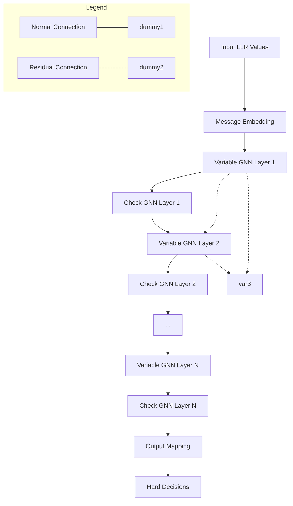
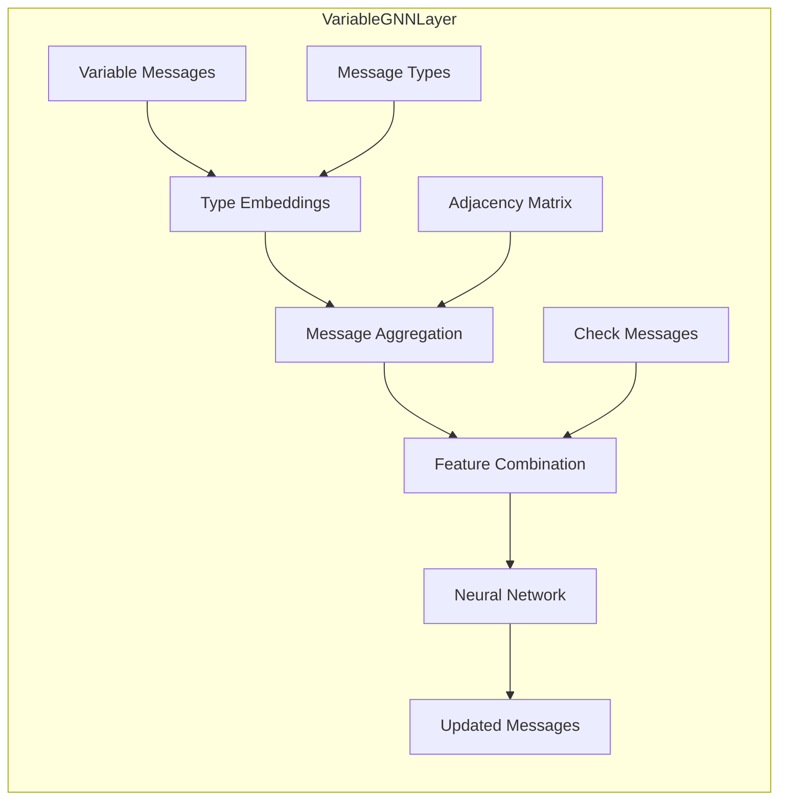
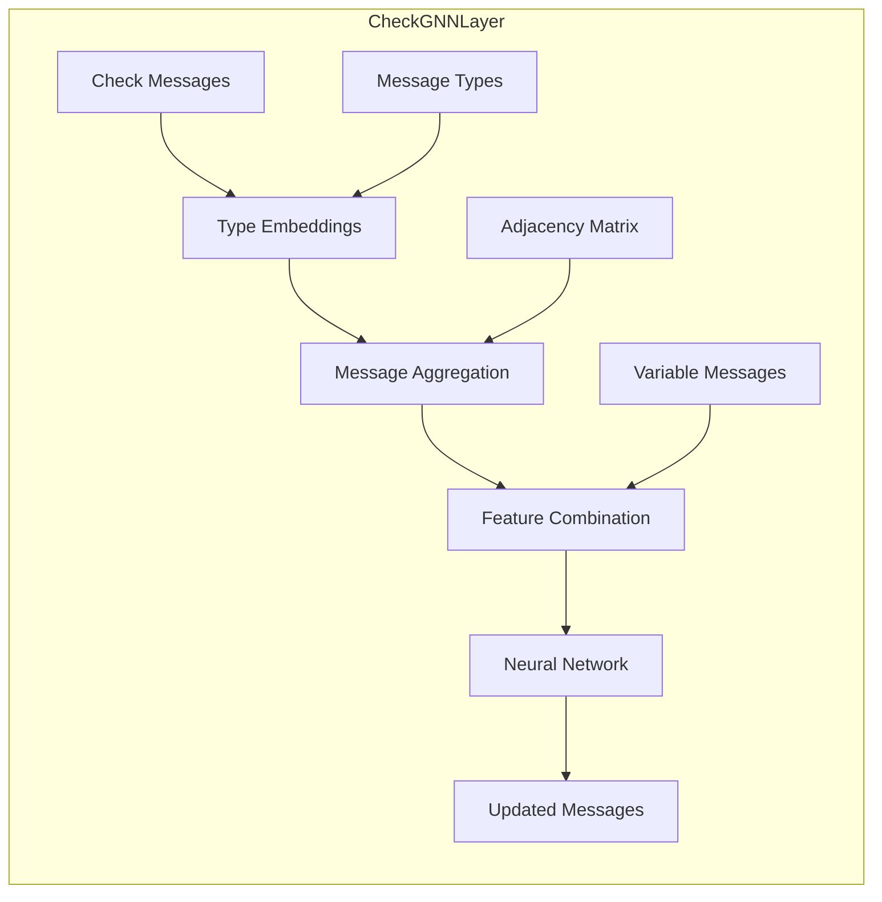
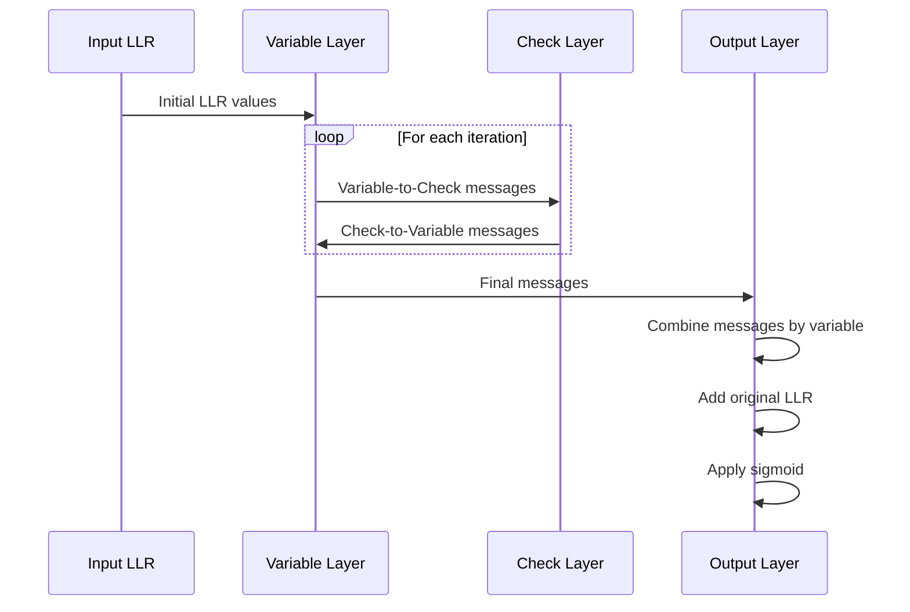
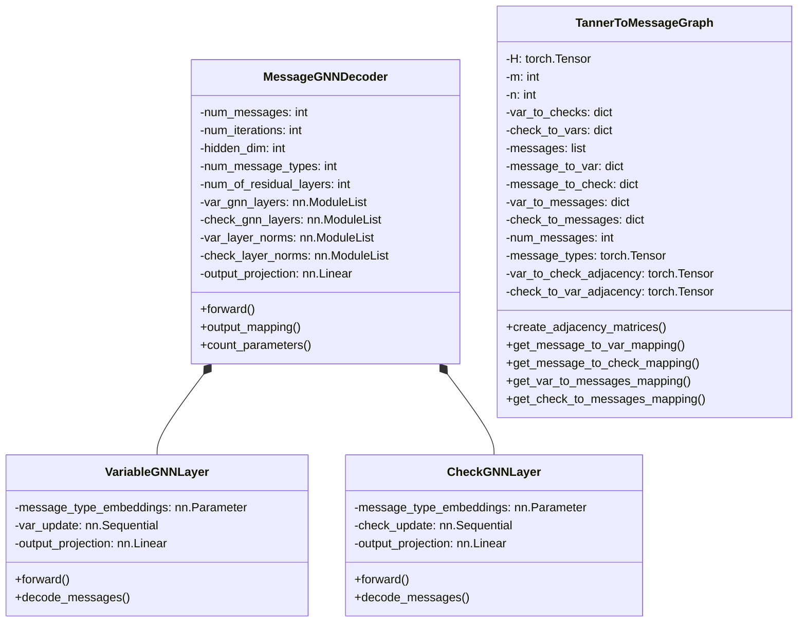

# Message-Centered GNN Architecture Diagrams

## Tanner Graph vs Message-Centered Graph

```mermaid
flowchart LR
    subgraph "Tanner Graph"
        direction TB
        v1[Variable Node 1]
        v2[Variable Node 2]
        v3[Variable Node 3]
        c1[Check Node 1]
        c2[Check Node 2]
        
        v1 --- c1
        v1 --- c2
        v2 --- c1
        v2 --- c2
        v3 --- c2
    end
    
    transform((Transform))
    
    subgraph "Message-Centered Graph"
        direction TB
        m1[Message 1: v1→c1]
        m2[Message 2: v1→c2]
        m3[Message 3: v2→c1]
        m4[Message 4: v2→c2]
        m5[Message 5: v3→c2]
        
        %% Messages sharing variables
        m1 --- m2
        m3 --- m4
        
        %% Messages sharing checks
        m1 --- m3
        m2 --- m4
        m2 --- m5
        m4 --- m5
    end
    
    "Tanner Graph" --> transform
    transform --> "Message-Centered Graph"
```

## Message GNN Decoder Architecture



## VariableGNNLayer Internal Structure



## CheckGNNLayer Internal Structure



## Message Passing Process



## Class Diagram

