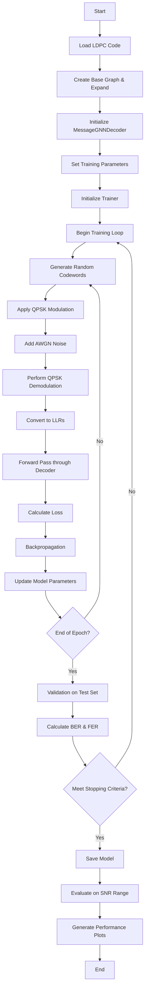

# Training Flow Chart for LDPC Neural Decoder

Below is a detailed flow chart of the training process for the Message GNN LDPC Decoder.

## Detailed Description of Each Step

### Setup Phase
1. **Load LDPC Code**: Read the parity-check matrix from a file (e.g., NR_2_0_4.txt).
2. **Create Base Graph & Expand**: Parse the base graph and expand it by the lifting factor.
3. **Initialize MessageGNNDecoder**: Create the decoder with specified parameters (number of iterations, hidden dimension, etc.).
4. **Set Training Parameters**: Define batch size, learning rate, number of epochs, etc.
5. **Initialize Trainer**: Create an LDPCDecoderTrainer instance with the decoder and training parameters.

### Training Loop
6. **Generate Random Codewords**: Create random batches of codewords (typically all-zero codewords for AWGN channels).
7. **Apply QPSK Modulation**: Convert bits to QPSK symbols.
8. **Add AWGN Noise**: Add Gaussian noise according to the specified SNR range.
9. **Perform QPSK Demodulation**: Convert noisy symbols back to soft information.
10. **Convert to LLRs**: Calculate Log-Likelihood Ratios from the received signals.

### Model Update
11. **Forward Pass through Decoder**: Process the input LLRs through the decoder network.
12. **Calculate Loss**: Compute the loss (typically binary cross-entropy) between the decoder output and ground truth.
13. **Backpropagation**: Calculate gradients with respect to model parameters.
14. **Update Model Parameters**: Apply gradient updates using the optimizer (e.g., Adam).

### Evaluation and Checkpointing
15. **Validation on Test Set**: Periodically evaluate the model on a separate test set.
16. **Calculate BER & FER**: Compute Bit Error Rate and Frame Error Rate on the validation set.
17. **Meet Stopping Criteria?**: Check if training should continue or stop (based on epochs or convergence).
18. **Save Model**: Store the trained model parameters.

### Final Evaluation
19. **Evaluate on SNR Range**: Test the final model over a range of SNR values.
20. **Generate Performance Plots**: Create BER and FER vs. SNR plots.

## Key Components in Training

### QPSK Modulation and Demodulation
QPSK mapping is used for efficient transmission, where pairs of bits are mapped to complex symbols.

### Dynamic SNR Training
The model is trained across a range of SNR values to ensure robust performance across different channel conditions.

### Message Type Sharing
Training leverages the base graph structure to share weights between similar message types, improving parameter efficiency.

### Residual Connections
The training process optimizes the use of residual connections from previous iterations to improve gradient flow.

### Loss Function
Binary cross-entropy loss is typically used, calculating the difference between the decoder's soft output probabilities and the ground truth bits. 