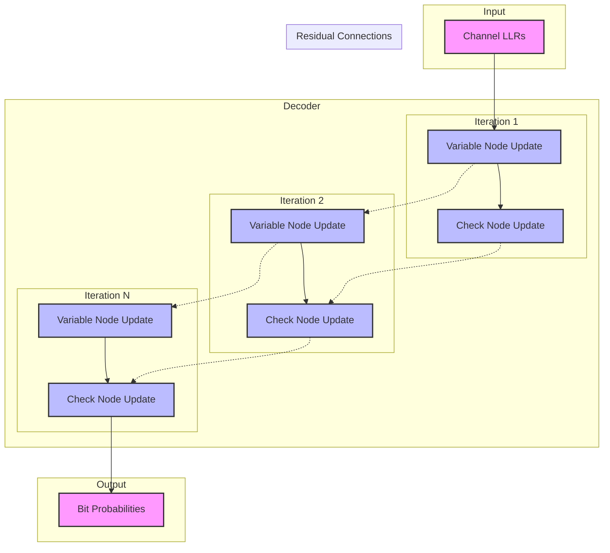

# Residual Decoder Architecture

## Overview
This diagram illustrates the architecture of the residual weight-sharing decoder, showing the flow of information and residual connections.

## Components

1. **Input Layer**
   - Channel LLRs (Log-Likelihood Ratios)
   - Initial bit probabilities

2. **Decoder Iterations**
   - Variable Node Updates
   - Check Node Updates
   - Weight sharing between similar message types

3. **Residual Connections**
   - Skip connections between iterations
   - Helps with gradient flow
   - Preserves information across iterations

4. **Output Layer**
   - Final bit probabilities
   - Decoded bits

## Message Flow

1. **Forward Pass**
   - LLRs → Variable Nodes → Check Nodes → ... (repeat)
   - Residual connections add previous iteration outputs

2. **Backward Pass**
   - Gradients flow through both direct and residual paths
   - Improved gradient flow due to skip connections

## Key Features

1. **Weight Sharing**
   - Parameters shared based on message types
   - Reduces model complexity
   - Maintains code structure

2. **Residual Depth**
   - Configurable number of previous iterations
   - Balances performance and memory usage

3. **Iteration Count**
   - Configurable number of iterations
   - Early stopping possible
   - Residual connections help convergence 