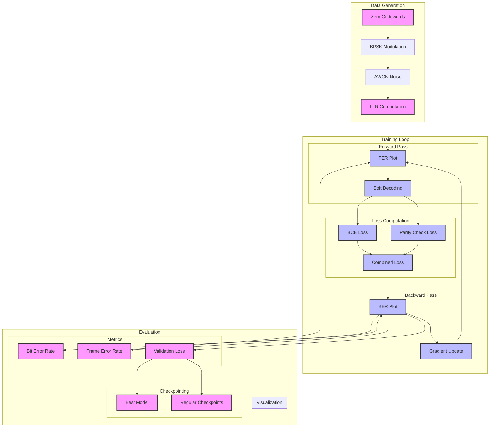

# Training Flow Diagram

## Overview
This diagram illustrates the complete training process, from data generation to model evaluation.

## Components

### 1. Data Generation
- Zero codewords generation
- BPSK modulation
- AWGN noise addition
- LLR computation

### 2. Training Loop
- Forward pass with soft decoding
- Loss computation (BCE + Parity)
- Backward pass
- Gradient updates

### 3. Evaluation
- Metrics computation
- Visualization
- Checkpointing

## Flow Description

1. **Data Generation**:
   - Start with zero codewords
   - Apply BPSK modulation
   - Add AWGN noise
   - Compute LLRs

2. **Training Process**:
   - Forward pass through decoder
   - Soft decoding for better gradients
   - Compute combined loss
   - Backward pass and updates

3. **Evaluation**:
   - Compute BER and FER
   - Track validation loss
   - Generate plots
   - Save checkpoints

## Key Features

1. **Soft Decoding**:
   - Continuous probability values
   - Better gradient flow
   - Improved training stability

2. **Loss Functions**:
   - Binary Cross-Entropy
   - Soft parity check loss
   - Weighted combination

3. **Monitoring**:
   - Real-time metrics
   - Visualization
   - Checkpointing 