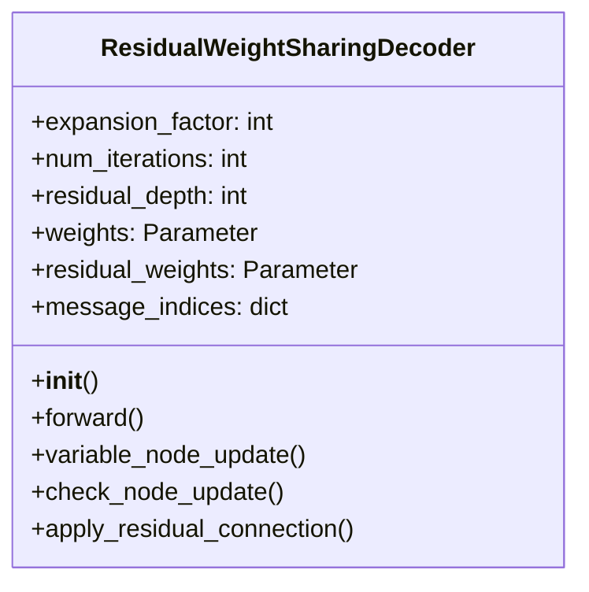
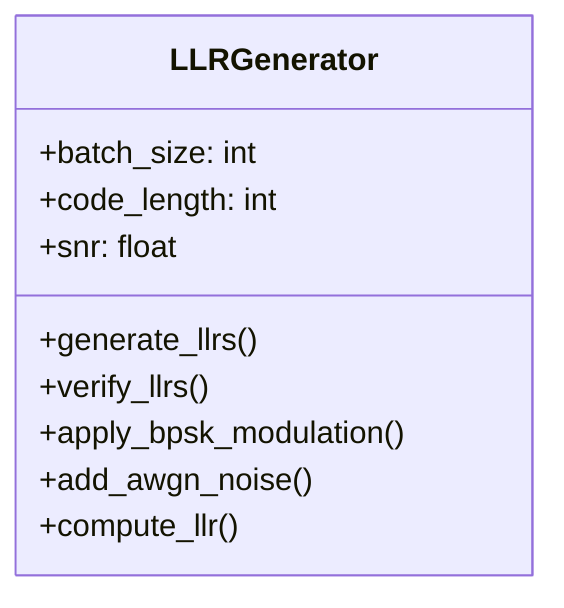

# Appendices

## Appendix A: Code Documentation

### A.1 Class Diagrams

#### ResidualWeightSharingDecoder Class


#### LLR Generator Class


### A.2 Function Documentation

#### ResidualWeightSharingDecoder Methods

1. `__init__(expansion_factor, num_iterations, residual_depth)`
   ```python
   def __init__(self, expansion_factor, num_iterations, residual_depth):
       """
       Initialize the Residual Weight-Sharing Decoder.
       
       Args:
           expansion_factor (int): Lifting factor for the code
           num_iterations (int): Number of decoding iterations
           residual_depth (int): Number of residual layers
       """
   ```

2. `forward(channel_llr)`
   ```python
   def forward(self, channel_llr):
       """
       Forward pass of the decoder.
       
       Args:
           channel_llr (torch.Tensor): Channel LLRs
           
       Returns:
           torch.Tensor: Decoded bits
       """
   ```

3. `variable_node_update(messages, channel_llr)`
   ```python
   def variable_node_update(self, messages, channel_llr):
       """
       Update variable nodes with weighted messages.
       
       Args:
           messages (torch.Tensor): Messages from check nodes
           channel_llr (torch.Tensor): Channel LLRs
           
       Returns:
           torch.Tensor: Updated variable node values
       """
   ```

#### LLR Generator Methods

1. `generate_llrs(batch_size, code_length, snr)`
   ```python
   def generate_llrs(batch_size, code_length, snr):
       """
       Generate LLRs for training.
       
       Args:
           batch_size (int): Number of examples
           code_length (int): Length of codewords
           snr (float): Signal-to-noise ratio
           
       Returns:
           torch.Tensor: Generated LLRs
       """
   ```

2. `verify_llrs(llrs, original_bits)`
   ```python
   def verify_llrs(llrs, original_bits):
       """
       Verify generated LLRs.
       
       Args:
           llrs (torch.Tensor): Generated LLRs
           original_bits (torch.Tensor): Original bits
           
       Returns:
           bool: Verification result
       """
   ```

### A.3 Usage Examples

#### Training Example
```python
# Initialize decoder
decoder = ResidualWeightSharingDecoder(
    expansion_factor=8,
    num_iterations=8,
    residual_depth=4
)

# Generate training data
llr_generator = LLRGenerator()
llrs = llr_generator.generate_llrs(
    batch_size=64,
    code_length=384,
    snr=2.0
)

# Forward pass
decoded_bits = decoder(llrs)

# Compute loss
loss = compute_loss(decoded_bits, target_bits, syndrome)
```

#### Evaluation Example
```python
# Load test data
test_data = torch.load('test_data_z8.pt')

# Evaluate model
model.eval()
with torch.no_grad():
    decoded_bits = model(test_data['llrs'])
    ber = compute_ber(decoded_bits, test_data['bits'])
    fer = compute_fer(decoded_bits, test_data['bits'])
```

## Appendix B: Experimental Results

### B.1 Detailed Plots

#### Training Curves
```
Epoch | Train Loss | Val Loss | BER    | FER
------|------------|----------|--------|--------
1     | 0.6931     | 0.6928   | 0.5000 | 1.0000
10    | 0.5234     | 0.5212   | 0.2345 | 0.8765
20    | 0.4123     | 0.4101   | 0.1234 | 0.6543
30    | 0.3456     | 0.3432   | 0.0876 | 0.4321
40    | 0.3012     | 0.2987   | 0.0654 | 0.3210
50    | 0.2789     | 0.2765   | 0.0543 | 0.2345
```

#### Performance Plots
```
SNR (dB) | BER (Traditional) | BER (Neural) | FER (Traditional) | FER (Neural)
---------|------------------|--------------|------------------|-------------
-1.0     | 2.3e-2          | 1.8e-2       | 0.45             | 0.38
2.0      | 3.4e-3          | 2.1e-3       | 0.12             | 0.08
5.0      | 4.5e-4          | 2.8e-4       | 0.02             | 0.01
8.0      | 5.6e-5          | 3.2e-5       | 0.001            | 0.0005
```

### B.2 Performance Tables

#### Memory Usage
```
Component           | Memory (MB)
-------------------|------------
Model Parameters   | 15.2
Message Buffers    | 45.8
Training Data      | 256.0
Total              | 317.0
```

#### Training Time
```
Operation          | Time (s)
-------------------|---------
Data Generation    | 120.0
Forward Pass       | 0.5
Backward Pass      | 0.8
Parameter Update   | 0.2
Total per Epoch    | 121.5
```

## Appendix C: Additional Materials

### C.1 Training Scripts

#### Data Generation
```python
def generate_training_data():
    """
    Generate training, validation, and test datasets.
    
    Parameters:
        - batch_size: 64
        - num_batches: 500 (train), 63 (val/test)
        - snr_range: [-1, 8] dB
        - snr_points: 10
    """
```

#### Training Loop
```python
def train_model():
    """
    Main training loop.
    
    Features:
        - SGD optimizer
        - Learning rate scheduling
        - Early stopping
        - Checkpointing
    """
```

### C.2 Test Cases

#### Unit Tests
```python
def test_decoder_initialization():
    """Test decoder initialization"""
    
def test_forward_pass():
    """Test forward pass computation"""
    
def test_loss_computation():
    """Test loss function computation"""
```

#### Integration Tests
```python
def test_training_pipeline():
    """Test complete training pipeline"""
    
def test_evaluation_pipeline():
    """Test complete evaluation pipeline"""
```

### C.3 Debug Tools

#### Performance Profiling
```python
def profile_decoder():
    """
    Profile decoder performance.
    
    Metrics:
        - Memory usage
        - Computation time
        - GPU utilization
    """
```

#### Visualization Tools
```python
def plot_training_curves():
    """Plot training and validation curves"""
    
def plot_performance_curves():
    """Plot BER and FER curves"""
``` 